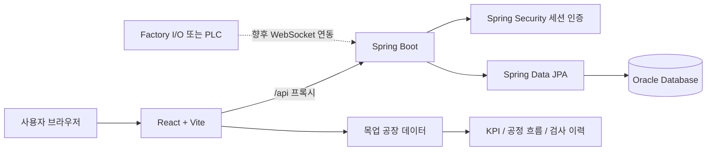
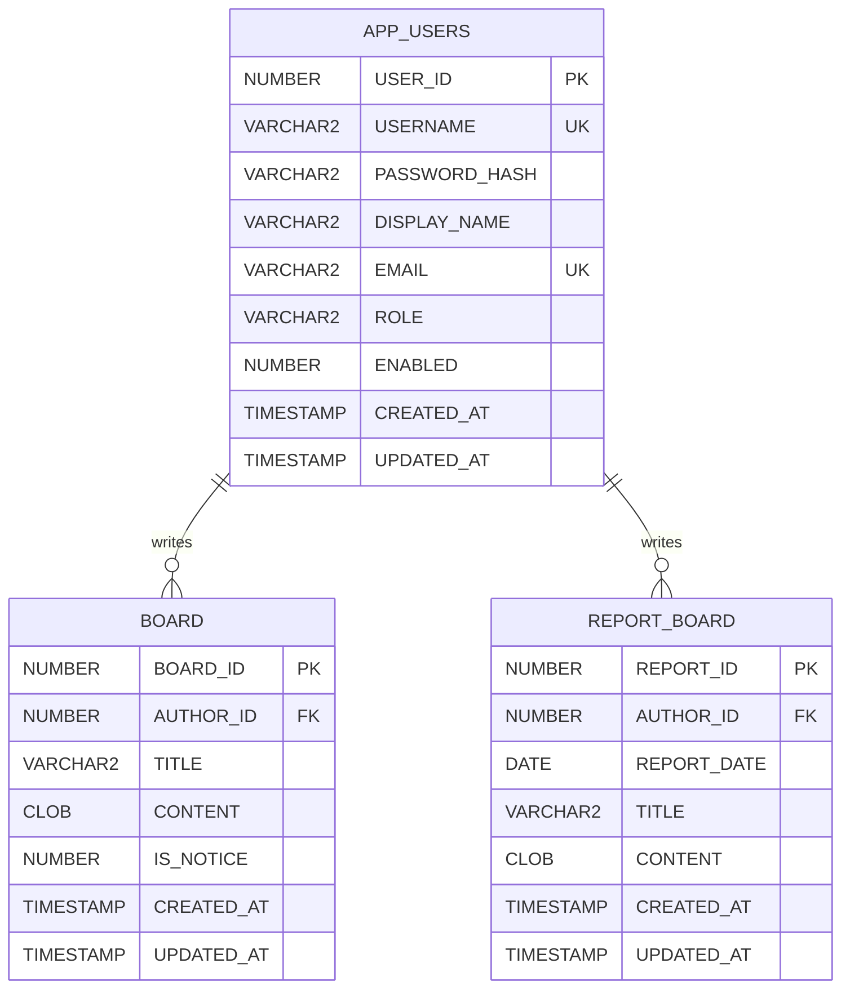
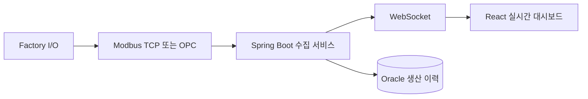

# MES 생산 모니터링 웹서비스

공장의 생산 현황을 한 화면에서 확인하고, 로그인한 사용자들이 공지 게시글과 생산 보고서를 공유할 수 있는 풀스택 웹서비스입니다.

이 프로젝트는 **React + Spring Boot + Oracle Database**로 구성되어 있으며, 사용자 인증, 일반 게시판, 보고서 게시판은 실제 백엔드와 데이터베이스에 연결되어 있습니다. 생산 KPI와 공정 흐름 데이터는 현재 프론트엔드 목업으로 동작하며, 이후 Factory I/O 또는 PLC 데이터를 WebSocket으로 연결하기 쉽게 분리되어 있습니다.

> **현재 구현 상태**  
> 로그인·회원가입, 게시판, 보고서 기능은 Oracle DB에 실제 저장됩니다.  
> 생산량, 불량률, 공정 흐름, 검사 이력은 1.5초 주기로 생성되는 목업 데이터입니다.

---

## 주요 기능

### 사용자 인증

- 회원가입 및 로그인
- 아이디·이메일 중복 검사
- 비밀번호 단방향 해시 저장
- HTTP 세션 기반 인증
- 로그인하지 않은 사용자의 대시보드·게시판 접근 차단
- 로그인 사용자 이름을 헤더에 `사용자 이름님` 형태로 표시
- 사용자 메뉴에서 아이디와 이메일 확인
- 로그아웃

### 생산 모니터링 대시보드

- 총생산, 양품, 불량, 불량률, 시간당 처리량(UPH) 표시
- 불량률 8% 초과 시 경고 UI 표시
- 투입 → 검사 → 분기 → 적재·불량 배출 공정 애니메이션
- 최신 검사 이력 테이블
- 일반 게시글과 보고서 미리보기 탭
- 라이트·다크 모드

### 일반 게시판

- 게시글 작성·조회·수정·삭제
- 제목과 내용 필수 입력
- 로그인 사용자의 회원 이름을 작성자로 자동 지정
- 작성자 이름 수정 불가
- 작성자 본인만 수정·삭제 가능
- 공지글 등록
- 공지 우선, 최신 작성순 정렬
- 페이지당 10개 페이징
- 이전글·다음글 이동
- 대시보드 미리보기와 전체 게시판 연결

### 보고서 게시판

- 일반 게시판과 분리된 `REPORT_BOARD` 테이블 사용
- 보고서 작성·조회·수정·삭제
- 보고 기준일 필수 선택
- 보고 기준일 최신순 정렬
- 문단과 표를 원하는 순서로 구성하는 블록형 편집기
- 표 행 최대 20개, 열 최대 10개
- 표의 첫 번째 행을 상세 화면에서 머리글로 표시
- 문단·표 순서 이동 및 삭제
- 작성자 본인만 수정·삭제 가능
- 이전 보고서·다음 보고서 이동

---

## 화면 경로

| 경로                      | 기능                   |
| ------------------------- | ---------------------- |
| `/login`                  | 로그인                 |
| `/signup`                 | 회원가입               |
| `/dashboard`              | 생산 모니터링 대시보드 |
| `/board`                  | 일반 게시판            |
| `/board?compose=1`        | 게시글 작성            |
| `/board?post={id}`        | 게시글 상세            |
| `/report-board`           | 보고서 게시판          |
| `/report-board?compose=1` | 보고서 작성            |
| `/report-board?post={id}` | 보고서 상세            |

모든 대시보드·게시판 경로는 로그인한 사용자만 접근할 수 있습니다.

---

## 시스템 구성



### 요청 흐름

1. 사용자가 React 화면에서 로그인합니다.
2. Vite 개발 서버가 `/api` 요청을 Spring Boot의 `localhost:8080`으로 전달합니다.
3. Spring Security가 세션 쿠키를 통해 사용자를 인증합니다.
4. JPA가 Oracle의 사용자·게시판·보고서 데이터를 조회하거나 저장합니다.
5. 수정과 삭제 시 서버에서 작성자 소유권을 다시 검사합니다.

---

## 기술 스택

| 구분           | 기술                                                                                 |
| -------------- | ------------------------------------------------------------------------------------ |
| Frontend       | React 19, React Router 7, Vite 8, CSS                                                |
| Backend        | Java 21, Spring Boot 4.0.7, Spring MVC, Spring Security, Spring Data JPA, Validation |
| Database       | Oracle Database 21c XE                                                               |
| Build          | Gradle, npm                                                                          |
| Authentication | HTTP Session, Spring Security PasswordEncoder                                        |
| Development    | DBeaver, VS Code                                                                     |

---

## 데이터베이스 구조



### 보고서 내용 저장 형식

보고서의 `CONTENT` 컬럼은 HTML이 아닌 JSON 문자열을 `CLOB`으로 저장합니다. 프론트엔드는 이 데이터를 안전하게 파싱해 문단과 표로 렌더링합니다.

```json
{
  "type": "mes-report-content",
  "version": 1,
  "blocks": [
    {
      "type": "text",
      "text": "금일 생산 결과입니다."
    },
    {
      "type": "table",
      "rows": [
        ["구분", "계획", "실적"],
        ["생산량", "1,000", "980"],
        ["불량", "10", "7"]
      ]
    }
  ]
}
```

---

## 프로젝트 구조

```text
factory-process-viewer-report-date-table/
├── README.md
├── backend/
│   ├── database/oracle/
│   │   ├── 01_create_app_users.sql
│   │   ├── 02_create_board.sql
│   │   ├── 03_create_report_board.sql
│   │   ├── 04_migrate_report_board_date_table.sql
│   │   └── 97~99_drop_*.sql
│   ├── src/main/java/com/factoryview/backend/
│   │   ├── config/          # Spring Security 설정
│   │   ├── controller/      # REST API
│   │   ├── domain/          # JPA 엔티티
│   │   ├── dto/             # 요청·응답 DTO
│   │   ├── exception/       # 공통 예외 처리
│   │   ├── repository/      # JPA Repository
│   │   └── service/         # 인증·게시판 비즈니스 로직
│   └── src/main/resources/application.properties
└── frontend/
    ├── src/
    │   ├── api/             # 백엔드 API 호출
    │   ├── components/
    │   │   ├── auth/        # 인증 라우트·사용자 메뉴
    │   │   ├── board/       # 게시판·보고서 UI
    │   │   ├── layout/      # 헤더·테마
    │   │   └── monitoring/  # KPI·공정도·검사 이력
    │   ├── hooks/           # 인증·게시글·보고서·공장 데이터 상태
    │   ├── mock/            # 현재 생산 목업 데이터
    │   ├── pages/           # 화면 단위 컴포넌트
    │   └── utils/           # 보고서 JSON 직렬화·파싱
    └── vite.config.js
```

---

## 실행 환경 준비

다음 프로그램이 필요합니다.

- Java 21
- Node.js와 npm
- Oracle Database 21c XE
- DBeaver 또는 Oracle SQL Developer

버전 확인:

```bash
java -version
node -v
npm -v
```

---

## 데이터베이스 설정

### 1. Oracle 사용자 연결

Spring Boot가 사용하는 Oracle 계정으로 접속합니다. 현재 프로젝트의 기본 계정명은 `factoryview`입니다.

```sql
SELECT USER AS CURRENT_DATABASE_USER
FROM DUAL;
```

조회 결과가 `FACTORYVIEW`인지 확인합니다.

### 2. 스키마 생성

새 데이터베이스에서는 아래 순서대로 실행합니다.

```text
1. backend/database/oracle/01_create_app_users.sql
2. backend/database/oracle/02_create_board.sql
3. backend/database/oracle/03_create_report_board.sql
```

기존의 구형 `REPORT_BOARD`를 날짜·표 지원 구조로 변경할 때만 다음 파일을 사용합니다.

```text
backend/database/oracle/04_migrate_report_board_date_table.sql
```

### DBeaver 실행 주의사항

- SQL 일부, 특히 `CONSTRAINT` 줄만 선택해 실행하지 마세요.
- `CREATE TABLE ... );` 전체를 한 문장으로 실행해야 합니다.
- macOS에서는 완전한 문장에 커서를 놓고 `Command + Enter`를 사용합니다.
- Windows에서는 완전한 문장에 커서를 놓고 `Ctrl + Enter`를 사용합니다.
- 파일 전체 스크립트 실행은 macOS `Option + X`, Windows `Alt + X`를 사용할 수 있습니다.

객체 생성 확인:

```sql
SELECT OBJECT_NAME, OBJECT_TYPE
FROM USER_OBJECTS
WHERE OBJECT_NAME IN (
    'APP_USERS', 'APP_USERS_SEQ',
    'BOARD', 'BOARD_SEQ',
    'REPORT_BOARD', 'REPORT_BOARD_SEQ'
)
ORDER BY OBJECT_TYPE, OBJECT_NAME;
```

---

## 백엔드 설정

`backend/src/main/resources/application.properties`에서 Oracle 접속 정보를 현재 환경에 맞게 변경합니다.

```properties
spring.datasource.url=jdbc:oracle:thin:@//localhost:1521/XE
spring.datasource.username=factoryview
spring.datasource.password=YOUR_PASSWORD
```

> 실제 비밀번호는 공개 저장소에 커밋하지 않는 것을 권장합니다. 운영 환경에서는 환경 변수나 별도의 비밀 설정 파일로 분리하세요.

### 백엔드 실행

macOS·Linux:

```bash
cd backend
chmod +x gradlew
./gradlew clean bootRun
```

Windows:

```bat
cd backend
gradlew.bat clean bootRun
```

백엔드는 기본적으로 다음 주소에서 실행됩니다.

```text
http://localhost:8080
```

연결 확인:

```text
GET http://localhost:8080/api/connection
```

---

## 프론트엔드 실행

```bash
cd frontend
npm install
npm run dev
```

프론트엔드는 다음 주소에서 실행됩니다.

```text
http://localhost:5173
```

`vite.config.js`의 프록시 설정을 통해 `/api` 요청이 `http://localhost:8080`으로 전달됩니다.

---

## API 요약

### 인증

| 메서드 | 경로               | 기능                    | 인증   |
| ------ | ------------------ | ----------------------- | ------ |
| POST   | `/api/auth/signup` | 회원가입                | 불필요 |
| POST   | `/api/auth/login`  | 로그인 및 세션 생성     | 불필요 |
| GET    | `/api/auth/me`     | 현재 로그인 사용자 조회 | 필요   |
| POST   | `/api/auth/logout` | 로그아웃                | 필요   |
| GET    | `/api/connection`  | 프론트·백엔드 연결 확인 | 불필요 |

### 일반 게시판

| 메서드 | 경로                               | 기능                 |
| ------ | ---------------------------------- | -------------------- |
| GET    | `/api/boards?page=0&size=10`       | 게시글 목록과 페이징 |
| GET    | `/api/boards/{boardId}`            | 게시글 상세          |
| GET    | `/api/boards/{boardId}/navigation` | 이전글·다음글        |
| POST   | `/api/boards`                      | 게시글 작성          |
| PUT    | `/api/boards/{boardId}`            | 게시글 수정          |
| DELETE | `/api/boards/{boardId}`            | 게시글 삭제          |

게시글 작성 예시:

```json
{
  "title": "설비 점검 공지",
  "content": "오늘 18시에 설비 점검을 진행합니다.",
  "notice": true
}
```

### 보고서 게시판

| 메서드 | 경로                                       | 기능                 |
| ------ | ------------------------------------------ | -------------------- |
| GET    | `/api/report-boards?page=0&size=10`        | 보고서 목록과 페이징 |
| GET    | `/api/report-boards/{reportId}`            | 보고서 상세          |
| GET    | `/api/report-boards/{reportId}/navigation` | 이전·다음 보고서     |
| POST   | `/api/report-boards`                       | 보고서 작성          |
| PUT    | `/api/report-boards/{reportId}`            | 보고서 수정          |
| DELETE | `/api/report-boards/{reportId}`            | 보고서 삭제          |

보고서 작성 예시:

```json
{
  "reportDate": "2026-07-29",
  "title": "일일 생산 보고서",
  "content": "{\"type\":\"mes-report-content\",\"version\":1,\"blocks\":[{\"type\":\"text\",\"text\":\"금일 생산 결과입니다.\"}]}"
}
```

작성자 정보는 요청 본문에서 받지 않습니다. 서버가 로그인 세션에서 사용자를 조회해 작성자를 자동 지정합니다.

---

## 인증 및 권한 규칙

- 회원 아이디는 영문·숫자·밑줄 조합 4~20자입니다.
- 아이디는 소문자로 정규화해 저장합니다.
- 사용자 이름은 최대 100자입니다.
- 이메일은 중복 가입할 수 없습니다.
- 비밀번호는 8~72자이며 원문이 아닌 해시값으로 저장합니다.
- `/api/auth/signup`, `/api/auth/login`, `/api/connection`을 제외한 API는 로그인이 필요합니다.
- 게시글과 보고서의 수정·삭제 권한은 화면 표시뿐 아니라 백엔드에서도 작성자 ID로 검증합니다.
- 세션 유효 시간은 기본 30분입니다.

---

## 테스트 및 빌드

백엔드 테스트:

```bash
cd backend
./gradlew test
```

프론트엔드 정적 검사:

```bash
cd frontend
npm run lint
```

프론트엔드 프로덕션 빌드:

```bash
npm run build
```

---

## 현재 제한 사항

- 대시보드의 생산 데이터는 실제 Factory I/O 데이터가 아닌 목업입니다.
- 목업 데이터는 `frontend/src/mock/mockFactoryData.js`에서 생성됩니다.
- `useFactoryData`가 1.5초마다 데이터를 갱신합니다.
- 실제 공장 설비 제어 API와 WebSocket 스트림은 아직 연결되어 있지 않습니다.
- Oracle 스키마는 현재 SQL 파일을 수동으로 실행해 관리합니다.
- 로컬 개발을 위해 CSRF가 비활성화되어 있으며, 세션 쿠키의 `secure` 옵션도 `false`입니다.

---

## 운영 배포 전 점검

- Oracle 비밀번호를 환경 변수나 Secret Manager로 분리
- HTTPS 적용 후 `server.servlet.session.cookie.secure=true` 설정
- 운영 도메인에 맞게 CORS 허용 주소 변경
- CSRF 보호 정책 적용
- Factory I/O 또는 PLC 데이터 수집 서버 연결
- 생산 이력용 별도 테이블과 장기 보관 정책 설계
- 관리자 전용 사용자·공지 관리 기능 추가
- 백엔드 통합 테스트와 프론트엔드 E2E 테스트 추가

---

## 향후 확장 방향



`useFactoryData`가 데이터 공급 방식을 한곳에 캡슐화하고 있어, 현재 타이머 기반 목업을 WebSocket 구독으로 교체하더라도 KPI·공정도·검사 이력 컴포넌트는 동일한 데이터 구조를 그대로 사용할 수 있습니다.

---

## 세부 설정 문서

- [로그인·회원가입 설정](backend/AUTH_SETUP.md)
- [일반 게시판 설정](backend/BOARD_SETUP.md)
- [보고서 게시판 설정](backend/REPORT_BOARD_SETUP.md)

---

## 프로젝트 요약

이 프로젝트는 단순한 대시보드 목업에서 출발해 다음 단계까지 확장된 MES 웹서비스입니다.

1. 로그인하지 않은 사용자의 접근을 차단하는 세션 인증
2. 사용자 이름과 권한이 연결된 일반 게시판 CRUD
3. 날짜와 표 편집기를 지원하는 보고서 게시판 CRUD
4. Oracle 외래키와 시퀀스를 활용한 데이터 구조
5. 향후 Factory I/O 실시간 연동을 고려한 프론트엔드 데이터 계층 분리

현재는 공장 데이터 연동 전 단계이지만, 인증과 협업 기능은 실제 데이터베이스 기반으로 동작하므로 이후 설비 제어·수집 기능을 추가할 수 있는 기반이 마련되어 있습니다.
